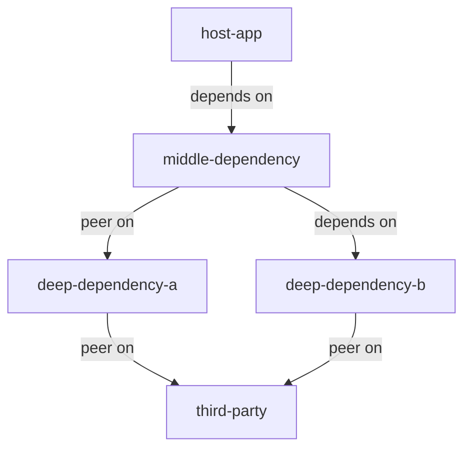
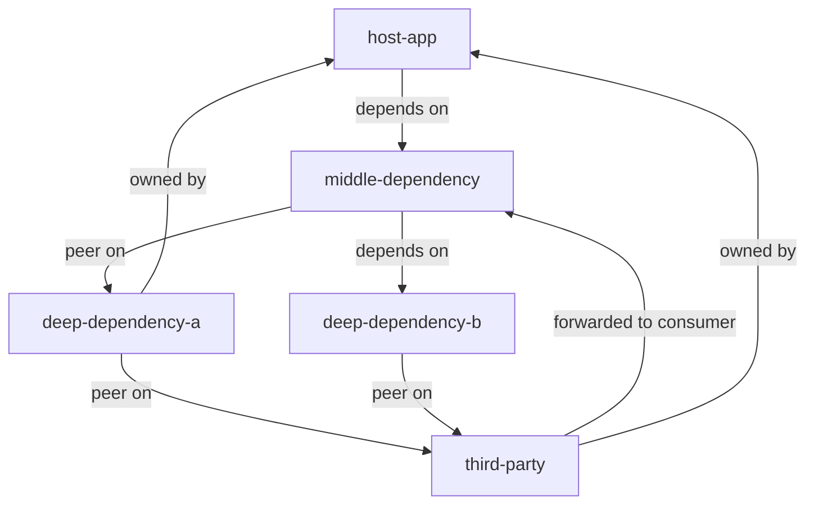

# Peer dependency tests

Tiny monorepo to experiment with seeing what correct peer behavior is.

```mermaid
flowchart TD
  host-app -- depends on --> middle-dependency
  middle-dependency -- peer on --> deep-dependency-a
  middle-dependency -- depends on --> deep-dependency-b
  deep-dependency-a -- peer on --> third-party
  deep-dependency-b -- peer on --> third-party
```

And once the peers are all declared: 

```mermaid
flowchart TD
  host-app -- depends on --> middle-dependency
  middle-dependency -- peer on --> deep-dependency-a
  middle-dependency -- depends on --> deep-dependency-b  
  deep-dependency-a -- peer on --> third-party
  deep-dependency-b -- peer on --> third-party
  
  third-party -- forwarded to consumer --> middle-dependency
  deep-dependency-a -- owned by --> host-app
  third-party -- owned by --> host-app
```
